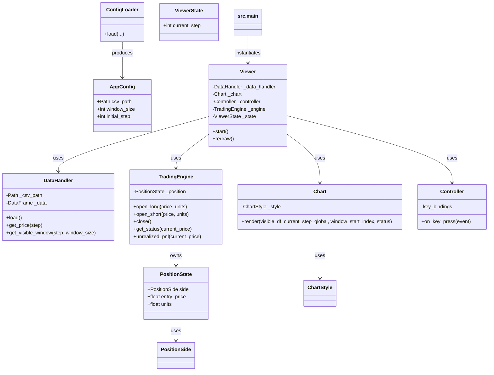

# Architecture Overview

このリポジトリのアーキテクチャ概要。

## モジュール一覧と役割

- `src.main`: エントリポイント。CLI解析、設定読み込み、各コンポーネントの組立て。
- `src.utils.config_loader`: `AppConfig` と設定読み込みロジック（JSON/CLIの優先解決）。
- `src.core.data_handler`: CSV読み込み・正規化・時系列データ提供。
- `src.core.engine`: 取引ポジション管理と PnL 計算（ビジネスロジック）。
- `src.visualization.chart`: 描画のみを担当（matplotlib）。
- `src.visualization.controller`: キー入力→アクションのマッピング。
- `src.visualization.viewer`: コンポーネント合成、再生制御、UIループ。

## クラス図（概要）

以下は主要クラスの関係（テキストベース、Mermaid）。

