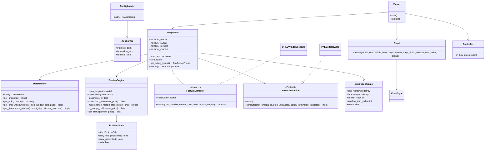

# Architecture Overview

このリポジトリは、Gymnasium互換の環境 `FxGymEnv` を中心に、データ処理・取引ロジック・観測/報酬・可視化を分離した構成です。
可視化（Viewer）はあくまでデバッグクライアントで、学習ループの主経路は RL Agent と Env のやり取りです。

## システム境界

- 中核: `src/envs/fx_gym_env.py` (`reset` / `step` / `action_space` / `observation_space`)
- 入力: OHLC CSV（`src/core/data_handler.py` がロード・正規化）
- 出力: `observation`, `reward`, `terminated`, `truncated`, `info`
- 任意UI: `src/visualization/viewer.py`（キー入力で `env.step(action)` を呼ぶ）

## モジュール責務

- `src/main.py`
  - CLI解析
  - `ConfigLoader` で設定読み込み
  - `FxGymEnv` を組み立てて、`headless` または `viewer` で実行
- `src/check.py`
  - `gymnasium.utils.env_checker.check_env` によるAPI互換検証
- `src/utils/config_loader.py`
  - JSON/YAML設定の読み込み
  - CLI引数の優先適用
  - `AppConfig(csv_path, window_size, initial_step)` を返却
- `src/core/data_handler.py`
  - CSV列名正規化、日時パース、OHLC数値化
  - NumPy配列 (`_ohlc`, `_timestamps`, `_close`) を保持
  - `step` 範囲外アクセス時の例外でlookaheadを防止
- `src/core/engine.py`
  - `PositionState` 管理（`FLAT/LONG/SHORT`）
  - スプレッド考慮の約定（longはask、shortはbid）
  - 評価損益、実現損益、維持率、勝率などを算出
- `src/core/features.py`
  - `FeatureExtractor` プロトコル
  - `OHLCWindowFeature` で固定長観測ベクトルを生成
- `src/core/rewards.py`
  - `RewardFunction` プロトコル
  - `PnLDeltaReward` でPnL差分ベースの報酬を算出
- `src/visualization/chart.py`
  - ローソク足描画とステータスパネル表示
- `src/visualization/controller.py`
  - キー入力とアクション実行の橋渡し
- `src/visualization/viewer.py`
  - Envクライアント
  - 手動ステップと自動再生（Space切替、1秒間隔）

## 実行モデル

1. `main.py` / `check.py` が設定を読み込み、`FxGymEnv` を初期化
2. `FxGymEnv.__init__` で `DataHandler`, `TradingEngine`, `FeatureExtractor`, `RewardFunction` を準備
3. `reset(options={"start_step": ...})` で開始ステップを確定し、観測と `info` を返す
4. `step(action)` で以下を実行
   - 事前価格で `prev_unrealized` を取得
   - アクション適用（`long/short` は内部で既存ポジションを一度クローズ）
   - ステップ進行、終了/打ち切り判定
   - 報酬計算、エピソード指標更新、観測/`info` 返却
5. Viewer利用時は `Viewer` が `env.step()` / `env.reset()` を呼び、`Chart` が描画

## クラス図（実装準拠）

## 設計上の要点

- Envはヘッドレスで完結し、Viewerは後付け可能
- ステップループではNumPyアクセスを使い、pandas依存を低減
- Feature/Rewardはプロトコル化され、差し替え実験がしやすい
