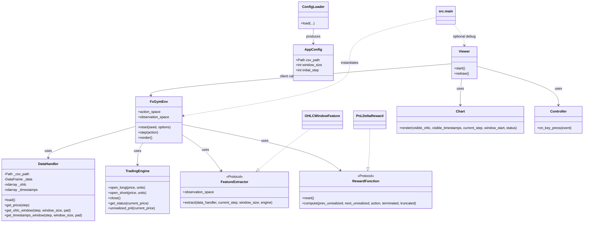

# Architecture Overview

このリポジトリは Gymnasium 互換のヘッドレス環境を中核にし、可視化はデバッグクライアントとして分離した構成です。

## モジュール一覧と役割

- src.main: エントリポイント。CLI解析、設定読み込み、FxGymEnv の組立て、必要に応じてデバッグViewer起動。
- src.utils.config_loader: AppConfig と設定読み込みロジック（YAML/JSON + CLI優先解決）。
- src.core.data_handler: CSV読み込み・正規化。読み込み時に NumPy 配列へ変換して高速アクセスAPIを提供。`get_ohlc_window` は範囲外stepで例外を送出し未来参照を禁止。
- src.core.engine: ポジション状態管理と uPnL 計算（純粋な取引ロジック）。
- src.core.features: Observation 生成プラグイン群（FeatureExtractor）。
- src.core.rewards: 報酬計算プラグイン群（RewardFunction）。
- src.envs.fx_gym_env: Gymnasium互換環境。reset/step/action_space/observation_space を提供。
- src.visualization.chart: デバッグ描画のみ（NumPy入力）。
- src.visualization.controller: キー入力を環境アクションへマッピング。
- src.visualization.viewer: Env クライアント。キー操作時に env.step(action) を呼ぶデバッグUI。

## 設計原則

- 主従関係: 外部エージェントが env.step(action) を呼び、環境が進む。
- 可視化の位置づけ: 学習本体から独立したオプショナルなデバッグ機能。
- 性能: ステップループでは pandas ではなく NumPy を利用。
- 拡張性: Feature/Reward を差し替え可能なプラグイン構造。

## クラス図（概要）

