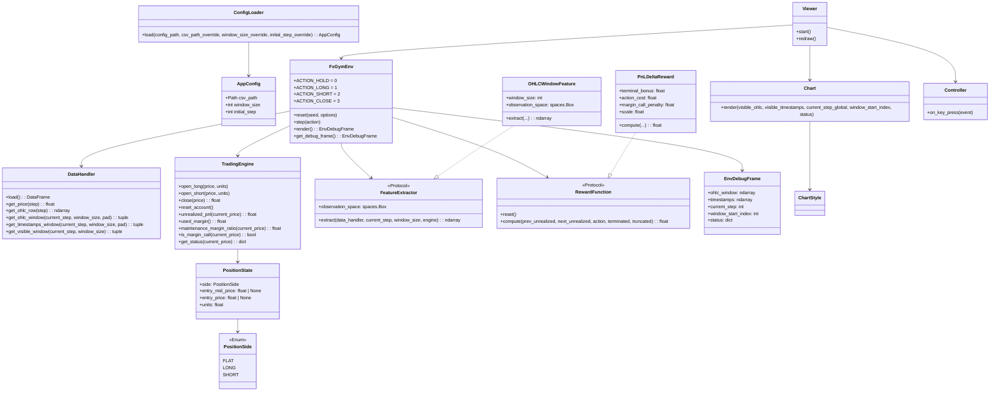

# クラス図（詳細）

実装されている主要クラスと依存関係を示します。

```mermaid
classDiagram
    class AppConfig {
        +Path csv_path
        +int window_size
        +int initial_step
    }
    class ConfigLoader {
        +load(config_path, csv_path_override, window_size_override, initial_step_override): AppConfig
    }

    class DataHandler {
        +load(): DataFrame
        +get_price(step): float
        +get_ohlc_row(step): ndarray
        +get_ohlc_window(current_step, window_size, pad): tuple
        +get_timestamps_window(current_step, window_size, pad): tuple
        +get_visible_window(current_step, window_size): tuple
    }

    class PositionSide {
        <<Enum>>
        FLAT
        LONG
        SHORT
    }
    class PositionState {
        +side: PositionSide
        +entry_mid_price: float | None
        +entry_price: float | None
        +units: float
    }

    class TradingEngine {
        +open_long(price, units)
        +open_short(price, units)
        +close(price): float
        +reset_account()
        +unrealized_pnl(current_price): float
        +used_margin(): float
        +maintenance_margin_ratio(current_price): float
        +is_margin_call(current_price): bool
        +get_status(current_price): dict
    }

    class FeatureExtractor {
        <<Protocol>>
        +observation_space: spaces.Box
        +extract(data_handler, current_step, window_size, engine): ndarray
    }
    class OHLCWindowFeature {
        +window_size: int
        +observation_space: spaces.Box
        +extract(...): ndarray
    }

    class RewardFunction {
        <<Protocol>>
        +reset()
        +compute(prev_unrealized, next_unrealized, action, terminated, truncated): float
    }
    class PnLDeltaReward {
        +terminal_bonus: float
        +action_cost: float
        +margin_call_penalty: float
        +scale: float
        +compute(...): float
    }

    class EnvDebugFrame {
        +ohlc_window: ndarray
        +timestamps: ndarray
        +current_step: int
        +window_start_index: int
        +status: dict
    }

    class FxGymEnv {
        +ACTION_HOLD = 0
        +ACTION_LONG = 1
        +ACTION_SHORT = 2
        +ACTION_CLOSE = 3
        +reset(seed, options)
        +step(action)
        +render(): EnvDebugFrame
        +get_debug_frame(): EnvDebugFrame
    }

    class ChartStyle
    class Chart {
        +render(visible_ohlc, visible_timestamps, current_step_global, window_start_index, status)
    }
    class Controller {
        +on_key_press(event)
    }
    class Viewer {
        +start()
        +redraw()
    }

    ConfigLoader --> AppConfig

    TradingEngine --> PositionState
    PositionState --> PositionSide

    OHLCWindowFeature ..|> FeatureExtractor
    PnLDeltaReward ..|> RewardFunction

    FxGymEnv --> DataHandler
    FxGymEnv --> TradingEngine
    FxGymEnv --> FeatureExtractor
    FxGymEnv --> RewardFunction
    FxGymEnv --> EnvDebugFrame

    Viewer --> FxGymEnv
    Viewer --> Chart
    Viewer --> Controller
    Chart --> ChartStyle
```

補足:

- `FxGymEnv` は依存注入可能な設計で、`data_handler` / `engine` / `feature_extractor` / `reward_function` を外部から差し替えられます。
- ViewerはEnvを利用するクライアントであり、環境ロジック自体は含みません。