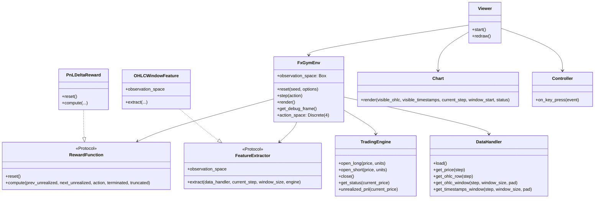

# クラス図（詳細）

Gymnasium互換環境を中心にした主要クラス構成。

```mermaid
classDiagram
    class DataHandler {
        +load()
        +get_price(step)
        +get_ohlc_row(step)
        +get_ohlc_window(step, window_size, pad)
        +get_timestamps_window(step, window_size, pad)
    }

    class TradingEngine {
        +open_long(price, units)
        +open_short(price, units)
        +close()
        +get_status(current_price)
        +unrealized_pnl(current_price)
    }

    class FeatureExtractor {
        <<Protocol>>
        +observation_space
        +extract(data_handler, current_step, window_size, engine)
    }

    class OHLCWindowFeature {
        +observation_space
        +extract(...)
    }

    class RewardFunction {
        <<Protocol>>
        +reset()
        +compute(prev_unrealized, next_unrealized, action, terminated, truncated)
    }

    class PnLDeltaReward {
        +reset()
        +compute(...)
    }

    class FxGymEnv {
        +reset(seed, options)
        +step(action)
        +render()
        +get_debug_frame()
        +action_space: Discrete(4)
        +observation_space: Box
    }

    class Chart {
        +render(visible_ohlc, visible_timestamps, current_step, window_start, status)
    }

    class Controller {
        +on_key_press(event)
    }

    class Viewer {
        +start()
        +redraw()
    }

    OHLCWindowFeature ..|> FeatureExtractor
    PnLDeltaReward ..|> RewardFunction
    FxGymEnv --> DataHandler
    FxGymEnv --> TradingEngine
    FxGymEnv --> FeatureExtractor
    FxGymEnv --> RewardFunction
    Viewer --> FxGymEnv
    Viewer --> Chart
    Viewer --> Controller
```

図は docs/architecture.md と整合しています。