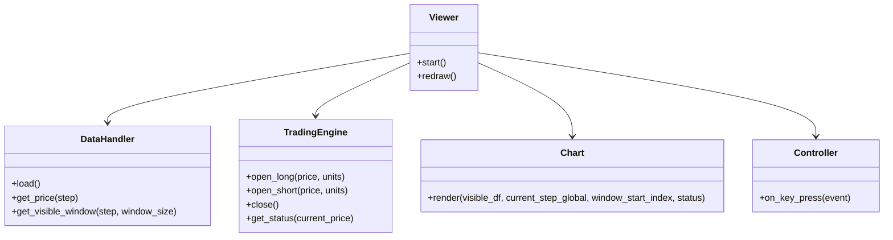

# クラス図（詳細）

主要クラスと公開メソッドの一覧（簡潔）。

```mermaid
classDiagram
    class DataHandler {
        +load()
        +get_price(step)
        +get_visible_window(step, window_size)
    }

    class TradingEngine {
        +open_long(price, units)
        +open_short(price, units)
        +close()
        +get_status(current_price)
    }

    class Chart {
        +render(visible_df, current_step_global, window_start_index, status)
    }

    class Controller {
        +on_key_press(event)
    }

    class Viewer {
        +start()
        +redraw()
    }

    Viewer --> DataHandler
    Viewer --> TradingEngine
    Viewer --> Chart
    Viewer --> Controller
```

図は `docs/architecture.md` 内のクラス図と整合しています。