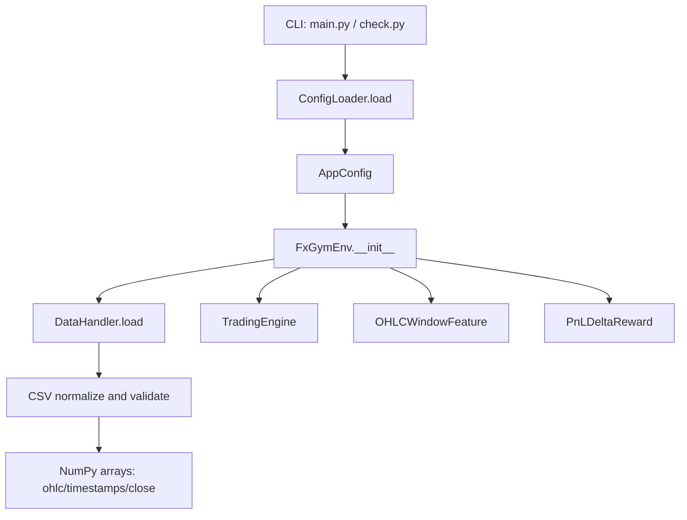
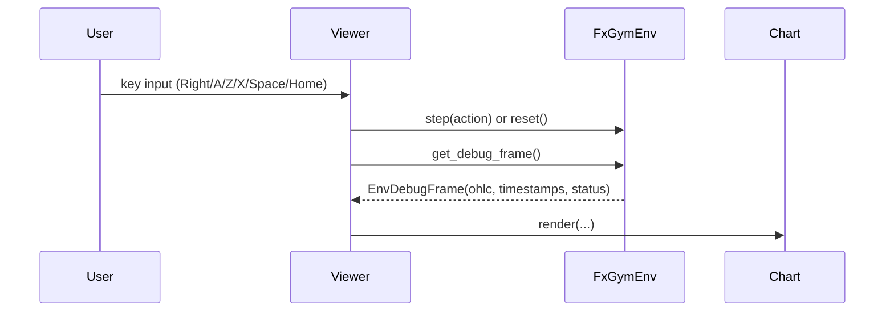

# Data Flow

`src` 配下の実装に基づく、初期化から `step()` までの実行フローです。

## 1. 初期化フロー

- `src/main.py` / `src/check.py` がCLIを受け取り、`ConfigLoader.load()` を呼び出す
- `ConfigLoader` がJSON/YAMLとCLI overrideを統合して `AppConfig` を返す
- `FxGymEnv` 初期化時に `DataHandler.load()` を実行（未ロードなら自動ロード）
- `DataHandler` はCSVを検証・正規化し、OHLC/時刻をNumPy配列化して保持する
- `FxGymEnv` は `TradingEngine`、`FeatureExtractor`、`RewardFunction` を組み合わせる

## 2. 1ステップ処理 (`FxGymEnv.step`)

1. 現在ステップ価格を取得し、`prev_unrealized` を計算
2. アクション適用
     - `hold`: 何もしない
     - `long`: `open_long`（内部で既存ポジションを先に `close`）
     - `short`: `open_short`（内部で既存ポジションを先に `close`）
     - `close`: `close`
3. 末尾でなければステップを1つ進める
4. `max_episode_steps` 到達なら `truncated=True`
5. 次ステップ価格で `next_unrealized` を計算
6. `terminated` を判定
     - データ末尾到達
     - または `is_margin_call == True`
7. `reward_function.compute(...)` で報酬を算出
8. エピソード統計（`episode_total_reward`, drawdown 等）を更新
9. 観測・`info` を返す

## 3. 観測と報酬の生成

- 観測 (`OHLCWindowFeature.extract`)
    - `window_size` 本のOHLC窓を取得（不足分は先頭値でpad）
    - 最終close基準で正規化してフラット化
    - 文脈4要素を連結
        - ポジション符号（flat/long/short）
        - 含み損益
        - スプレッド
        - 維持率シグナル
- 報酬 (`PnLDeltaReward.compute`)
    - 基本: `(next_unrealized - prev_unrealized) * scale`
    - アクションコスト: `action != hold` のとき減算
    - 終端ボーナス: `terminated and not truncated` のとき加算
    - マージン系ペナルティ: `terminated and next_unrealized < prev_unrealized` のとき減算

## 4. 可視化（任意経路）

補足:

- Viewerはデバッグ用途で、学習本体に必須ではありません。
- 主経路は RL Agent と `FxGymEnv` のインタラクションです。