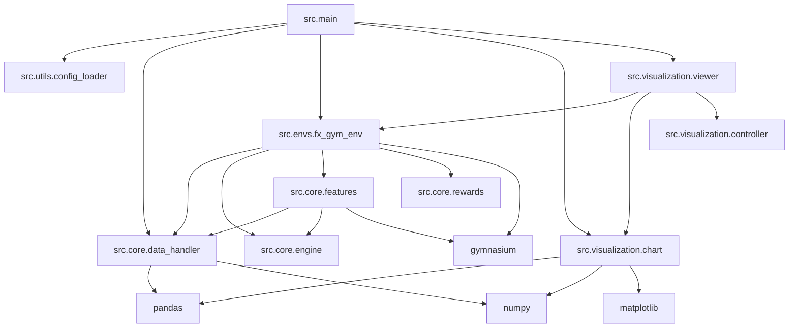

# モジュール依存関係

プロジェクト内部のモジュール依存を示します。

```mermaid
graph TD
    main["src.main"] --> config_loader["src.utils.config_loader"]
    main --> core_data_handler["src.core.data_handler"]
    main --> env_fx["src.envs.fx_gym_env"]
    main --> visualization_chart["src.visualization.chart"]
    main --> visualization_viewer["src.visualization.viewer"]

    env_fx --> core_data_handler
    env_fx --> core_engine["src.core.engine"]
    env_fx --> core_features["src.core.features"]
    env_fx --> core_rewards["src.core.rewards"]

    core_features --> core_data_handler
    core_features --> core_engine

    visualization_viewer --> env_fx
    visualization_viewer --> visualization_chart
    visualization_viewer --> visualization_controller["src.visualization.controller"]

    %% 補足: 外部ライブラリ
    gymnasium["gymnasium"]
    pandas["pandas"]
    matplotlib["matplotlib"]
    numpy["numpy"]

    env_fx --> gymnasium
    core_features --> gymnasium
    core_data_handler --> pandas
    core_data_handler --> numpy
    visualization_chart --> pandas
    visualization_chart --> numpy
    visualization_chart --> matplotlib
```

- 循環依存はない。主経路は main → FxGymEnv → core モジュール。
- 可視化層は任意依存で、学習ループの必須依存ではない。
- DataHandler は pandas を初期読み込み時にのみ使い、ステップ時は NumPy を利用。
