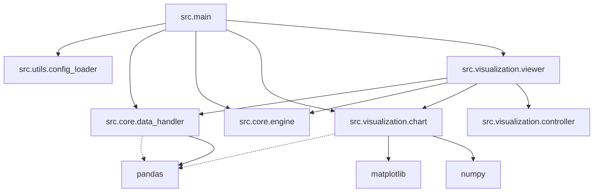

# モジュール依存関係

プロジェクト内部のモジュール依存を示します。

```mermaid
graph TD
    main["src.main"] --> config_loader["src.utils.config_loader"]
    main --> core_data_handler["src.core.data_handler"]
    main --> core_engine["src.core.engine"]
    main --> visualization_chart["src.visualization.chart"]
    main --> visualization_viewer["src.visualization.viewer"]

    visualization_viewer --> core_data_handler
    visualization_viewer --> core_engine
    visualization_viewer --> visualization_chart
    visualization_viewer --> visualization_controller["src.visualization.controller"]

    visualization_chart -.-> pandas
    core_data_handler -.-> pandas

    %% 補足: 外部ライブラリ
    pandas["pandas"]
    matplotlib["matplotlib"]
    numpy["numpy"]

    visualization_chart --> matplotlib
    visualization_chart --> numpy
    core_data_handler --> pandas
```

- 循環依存は観察されない（`main` が組み立てを担当し、他は一方向の依存）。
- 可視化層は外部ライブラリ（`matplotlib`, `numpy`）に依存。
