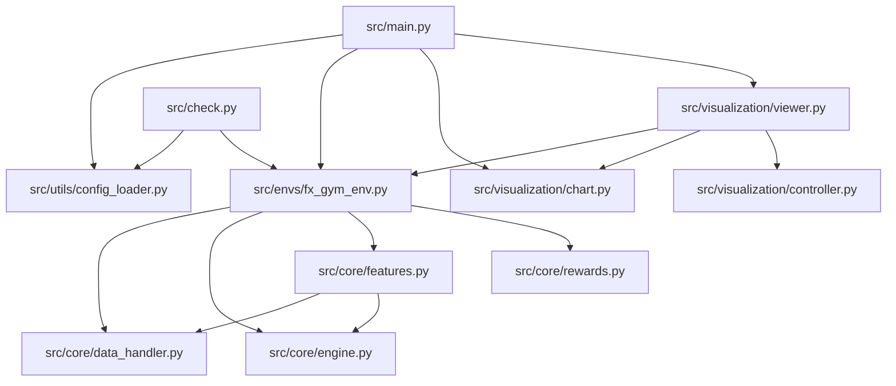

# モジュール依存関係

`src` 配下の実コードに基づく内部依存・外部依存を整理します。

## 1. 内部モジュール依存

## 2. 外部ライブラリ依存

| ライブラリ | 主な利用箇所 | 目的 |
| :-- | :-- | :-- |
| gymnasium | `src/envs/fx_gym_env.py`, `src/core/features.py`, `src/check.py` | Env API実装、`spaces.Box/Discrete`、`check_env` |
| numpy | `src/core/data_handler.py`, `src/core/features.py`, `src/envs/fx_gym_env.py`, `src/visualization/chart.py` | 高速配列処理、観測生成、描画入力 |
| pandas | `src/core/data_handler.py`, `src/visualization/chart.py` | CSV読み込み・日時処理 |
| matplotlib | `src/visualization/chart.py`, `src/visualization/viewer.py` | デバッグ可視化UI |
| PyYAML（任意） | `src/utils/config_loader.py` | YAML設定ファイルの読み込み |

## 3. 依存構造の要点

- 循環依存はありません。
- 主経路は `main/check -> FxGymEnv -> core` です。
- 可視化層は任意で、Env本体はヘッドレスで動作します。
- `DataHandler` は初期ロードでpandasを使い、ステップ中はNumPyアクセス中心です。
